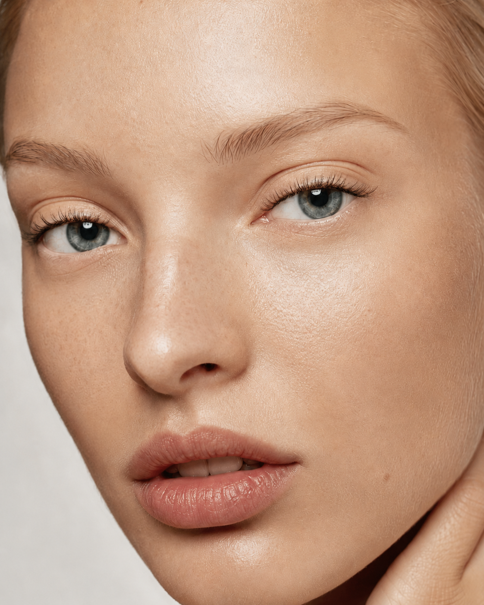
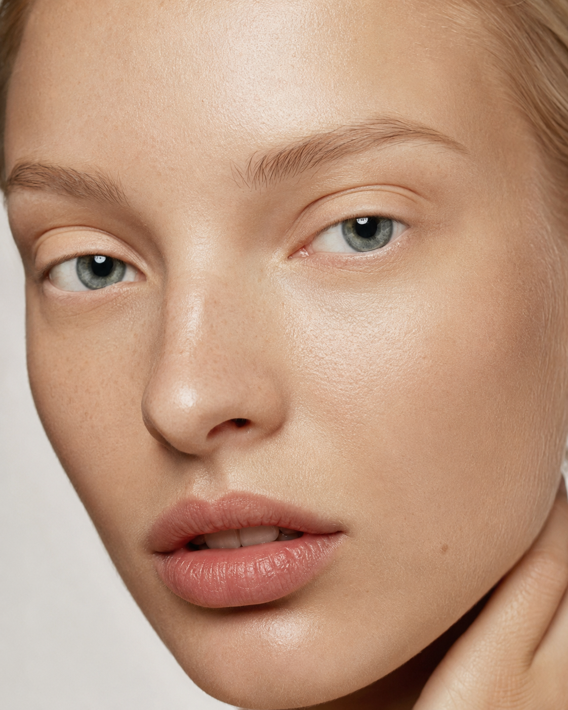

# 睫毛虚拟试戴网站项目清单

## 项目定位

项目名称：睫毛虚拟试戴网站 / Lash Virtual Try-On

目标用户：
- 睫毛生产商
- 批发客户
- 美妆品牌
- 终端消费者

核心目标：用户上传照片或打开摄像头后，预览不同睫毛款式在自己眼睛上的效果，并辅助选款、询盘或购买。

## 当前已完成

- 单页网页版原型
- 上传脸部照片
- 摄像头实时预览
- 人脸/眼部关键点识别
- 左右眼睫毛自动贴合
- 厂家睫毛款式库
- 按长度、翘度、粗细、颜色筛选
- 当前选中款式展示
- 上传自有睫毛素材
- 自有素材保存到浏览器本地
- 删除自有素材
- 长度、浓密度、翘度、粗细、贴合高度调节
- 原睫毛遮盖
- 试戴前后对比
- 保存预览图
- 左侧工具栏独立滚动
- 右侧画布自适应视口
- MediaPipe 模型、wasm、lucide 图标已本地化

## 主要解决问题：睫毛真实度

当前原型已经能完成上传、识别、贴合和预览，但距离可商用的真实试戴效果还需要继续打磨。后续围绕“睫毛看起来像从真实眼睑长出来”这个目标，按以下小目标逐项实现。

### 参考图

这两张图作为后续真实度优化的视觉基准：一张是目标效果，一张是无睫毛基准图。所有合成改动都应尽量靠近目标效果，同时保留基准图里真实皮肤、眼睑、眼角和眼球的自然关系。

| 最终效果参考：有睫毛 | 基准图：无睫毛 |
| --- | --- |
|  |  |

### 1. 内眼角真实空白区

目标：靠近泪阜的位置不长睫毛，只在过渡区出现很短、很稀的毛，符合人体眼部结构。

验收点：
- 内眼角最靠近鼻梁的位置没有新睫毛。
- 过渡区不是突然开始，而是由短、稀、淡逐步进入正常密度。
- 左右眼都能正确识别内眼角方向，不被镜像逻辑反向。

### 2. 不规则毛囊点位

目标：睫毛不要等距排列，改成自然疏密变化，避免“梳子感”和程序生成感。

验收点：
- 每根睫毛间距有轻微随机变化。
- 局部可以自然分簇，但不能形成规则重复图案。
- 中段、外眼角、内侧的疏密节奏不同。

### 3. 根部贴合线优化

目标：睫毛根部像从眼睑长出来，不悬浮，也不变成明显黑色眼线。

验收点：
- 根部贴合上眼睑弧线。
- 根部融合线足够细，只增强贴合感，不抢眼。
- 在眼部特写中看不到明显漂浮或断层。

### 4. 多层睫毛结构

目标：短毛、中毛、长毛分层叠加，而不是单层一排。

验收点：
- 底层短毛负责密度。
- 主层中长毛负责款式轮廓。
- 少量外层长毛形成自然层次和外眼角表现。

### 5. 自然角度变化

目标：每根睫毛角度根据眼睛位置变化，中段向上，外眼角略向外，内侧更短更收。

验收点：
- 内侧睫毛短且角度收敛。
- 中段睫毛向上打开。
- 外眼角睫毛略向外延展，但不夸张。

### 6. 尖端渐隐和材质显色

目标：根部更实，尖端更细更淡，有真实 PBT 纤维质感。

验收点：
- 睫毛根部可见但不脏。
- 尖端自然变细、透明度降低。
- 黑色不是纯硬黑，能保留轻微纹理和高光。

### 7. 眼皮遮挡关系

目标：根部部分被上眼皮轻微压住，避免贴图浮在眼睛上方。

验收点：
- 睫毛根部有轻微被眼睑覆盖的感觉。
- 遮盖不能把新睫毛整体压淡。
- 眼皮、原生睫毛、新睫毛三者层级自然。

### 8. 眼部特写评估模式

目标：每次调整后用眼部 1:1 特写检查根部、角度、浓淡和左右眼一致性。

验收点：
- 上传图片后同时显示完整人脸和眼部特写。
- 特写区域聚焦真实眼睛区域，不是整张脸缩略图。
- 可以清楚检查内眼角、根部融合、睫毛层次和材质。

## 现有文件结构

- `index.html`：页面结构
- `styles.css`：界面布局和视觉样式
- `app.js`：识别、试戴、素材库、交互逻辑
- `models/face_landmarker.task`：本地人脸识别模型
- `vendor/mediapipe/tasks-vision/`：本地 MediaPipe 依赖
- `vendor/lucide/lucide.min.js`：本地图标库

## 核心功能清单

### 1. 用户输入

- 上传 JPG / PNG / WebP 人脸图片
- 打开摄像头
- 摄像头拍照定格
- 空状态提示
- 加载状态提示
- 识别失败提示

### 2. 人脸识别

- 加载 FaceLandmarker 模型
- 检测单张图片人脸
- 检测摄像头视频帧
- 获取左右眼关键点
- 模型加载完成后重新识别当前照片
- 识别失败时提供 fallback 示意眼位

### 3. 睫毛试戴

- 左右眼分别贴合
- 根据眼睛宽度自动缩放
- 根据眼睛角度自动旋转
- 右眼自动镜像
- 程序生成示意睫毛
- 上传真实睫毛 PNG 后叠加真实素材
- 原睫毛遮盖/柔化
- 保存合成预览图

### 4. 厂家睫毛库

- SKU
- 系列名称
- 产品名称
- 长度规格
- 翘度规格
- 粗细规格
- 颜色规格
- 当前选中产品卡片
- 款式缩略图
- 筛选器
- 清除筛选

### 5. 自有素材库

- 多文件上传
- 支持 PNG / WebP / 图片格式
- 素材预览
- 素材名称展示
- 保存到 localStorage
- 页面刷新后保留
- 删除素材
- 选中后参与试戴

### 6. 参数调节

- 长度
- 浓密度
- 翘度微调
- 粗细微调
- 贴合高度
- 原睫毛遮盖强度
- 重置参数
- 试戴前后对比

## 素材准备清单

- 每个 SKU 一张透明背景 PNG
- 建议单只上睫毛
- 睫毛根部靠近图片底部
- 图片横向摆放
- 建议宽度 1000px 以上
- 文件名建议包含 SKU
- 每款需要记录：SKU、名称、系列、长度、翘度、粗细、颜色
- 最好额外准备左右眼独立素材，提升真实度

## 下一阶段建议

### 1. 左右眼独立微调

- 左眼 X/Y 偏移
- 右眼 X/Y 偏移
- 左右眼单独缩放
- 左右眼单独旋转
- 保存每个 SKU 的默认贴合参数

### 2. 产品化睫毛库

- 从 JSON 文件加载产品库
- 支持批量导入 SKU
- 支持真实 PNG 绑定 SKU
- 支持产品详情弹窗
- 支持询盘按钮
- 支持 WhatsApp / 邮箱 / 表单联系

### 3. 试戴效果增强

- 更自然的睫毛根部融合
- 眼睑阴影
- 透明度控制
- 睫毛弯曲变形
- 不同眼型适配
- 更准确的原睫毛去除

### 4. 部署上线

- 静态网站部署
- HTTPS
- 本地模型文件缓存
- 移动端摄像头适配
- 隐私政策页面
- 图片不上传服务器声明
- 基础访问统计

## 验收标准

- 无外部 CDN 依赖也能加载页面和识别模型
- 上传照片后能识别人眼并贴合睫毛
- 摄像头模式可正常运行
- 自有睫毛 PNG 可上传、保存、删除、试戴
- 原睫毛遮盖有效
- 页面不被大图撑长
- 左侧工具栏可独立滚动
- 保存预览图可正常下载
- Chrome / Safari 至少一个桌面浏览器正常
- 手机浏览器能完成上传图片试戴流程
